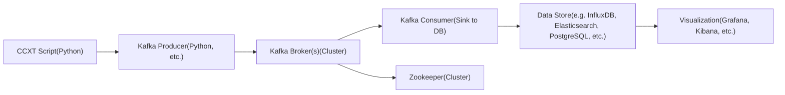

# Crypto OHLC Data Pipeline
This repository contains an end-to-end example of fetching real-time crypto trades (from Binance via CCXT), publishing them to Kafka, consuming them from Kafka, and computing 1-minute OHLC bars. The bars are then stored in InfluxDB for visualization through Grafana.


---

---

## 1. Project Overview

- **Docker Compose (`docker-compose.yml`)**  
  Defines containers for Zookeeper, Kafka, InfluxDB, and Grafana.

- **Kafka Producer (`kafka_producer.py`)**  
  Fetches trades using CCXT and sends them to a Kafka topic (`crypto-ticks` by default).

- **Kafka Consumer with InfluxDB (`kafka_consumer_with_influxdb.py`)**  
  Consumes trades from Kafka, computes OHLC bars in-memory, and periodically writes them to InfluxDB.

---

## 2. Prerequisites

- Docker and Docker Compose  
- Python 3.7+ (if you plan to run the producer/consumer locally)  
- Internet connection to fetch trades from Binance (via CCXT)

---

## 3. File Descriptions

### **docker-compose.yml**

Defines the following services:

1. **Zookeeper**  
   - Image: `bitnami/zookeeper:latest`  
   - Container name: `zookeeper`  
   - Port: `2181` (mapped to the host)

2. **Kafka**  
   - Image: `bitnami/kafka:latest`  
   - Container name: `kafka`  
   - Depends on Zookeeper  
   - Ports: `9092` (mapped to the host)  
   - Environment variables:  
     - `KAFKA_BROKER_ID=1`  
     - `KAFKA_LISTENERS=PLAINTEXT://0.0.0.0:9092`  
     - `KAFKA_ADVERTISED_LISTENERS=PLAINTEXT://localhost:9092`  
     - `KAFKA_ZOOKEEPER_CONNECT=zookeeper:2181`  
     - `ALLOW_PLAINTEXT_LISTENER=yes`

3. **InfluxDB (1.8)**  
   - Image: `influxdb:1.8`  
   - Container name: `influxdb`  
   - Port: `8086` (mapped to the host)  
   - Volume: `influx_data` (for data persistence)  
   - Environment variables:  
     - `INFLUXDB_DB=crypto_data`  
     - `INFLUXDB_USER=admin`  
     - `INFLUXDB_ADMIN_USER=admin`  
     - `INFLUXDB_ADMIN_PASSWORD=admin123`  
     - `INFLUXDB_PASSWORD=admin123`

4. **Grafana**  
   - Image: `grafana/grafana:latest`  
   - Container name: `grafana`  
   - Port: `3000` (mapped to the host)  
   - Depends on InfluxDB  
   - Volume: `grafana_data` (for data persistence)  
   - Environment variable:  
     - `GF_SECURITY_ADMIN_PASSWORD=admin123`

**Volumes**:
- `influx_data`  
- `grafana_data`

### **kafka_producer.py**

- **Purpose**: Continuously fetches recent trades from Binance (using [CCXT](https://github.com/ccxt/ccxt)) and publishes them to the `crypto-ticks` Kafka topic.  
- **Fetch interval**: 10 seconds (configurable by `FETCH_INTERVAL`).  
- **Kafka servers**: Defaults to `localhost:9092` in the code.

**Usage (locally)**:
```bash
pip install ccxt kafka-python
python kafka_producer.py
```
---

## 4. Getting Started
### 4.1 Clone the Repository
```bash
git clone https://github.com/yourusername/yourrepo.git
cd yourrepo
```
### 4.2 Start Docker Services

```bash
Copy code
docker-compose up -d
```
This will start the following containers:

- zookeeper
- kafka
- influxdb
- grafana
Verify their status:

```bash
docker-compose ps
```
### 4.3 Verify Services
### Kafka
- Should be running on `localhost:9092`.
- Test connectivity using a Kafka client or the kafkacat utility.

## InfluxDB
- Available on `localhost:8086`.
- You can verify by running:
```bash
docker exec -it influxdb influx -username admin -password admin123
```
Then:
```sql
SHOW DATABASES;
```
You should see `crypto_data`.

### Grafana
- Accessible at http://localhost:3000.
- Default credentials: `admin / admin123`.
- After login, add InfluxDB as a data source.
## 5. Run the Producer and Consumer
### Producer
```bash
pip install ccxt kafka-python
python kafka_producer.py
```
- Fetches trades for `BTC/USDT`.
- Sends them to `crypto-ticks`.
### Consumer
```bash
pip install kafka-python influxdb
python kafka_consumer_with_influxdb.py
```
- Consumes trades from `crypto-ticks`.
- Aggregates into 1-minute bars and writes them to `crypto_data` in InfluxDB.
---
## 6. Visualizing Data in Grafana
1. Go to http://localhost:3000.
2. Log in with the default credentials (`admin / admin123`).
3. Add a new data source:
- Type: InfluxDB
- URL: `http://influxdb:8086` (if referencing via the Docker network) or `http://localhost:8086` if connecting from your host
- Database: `crypto_data`
- User: `admin`
- Password: `admin123`
4. Create a new dashboard and panel.
- Query the measurement `ohlc_1m` to chart the data.
---
## 7. Troubleshooting
- Kafka Connection Errors
Ensure `KAFKA_ADVERTISED_LISTENERS` is set to `PLAINTEXT://localhost:9092` if the producer/consumer scripts run on your host.

- InfluxDB Write Errors
Check consumer logs for details. Verify InfluxDB credentials and database name.

- Grafana Access
If port `3000` is already in use, either change the host port in `docker-compose.yml` file or free up that port.
---
## 8. Contributing
Contributions are welcome! Feel free to open issues or pull requests for bug fixes, new features, or improvements.

---
## 9. License
MIT License
